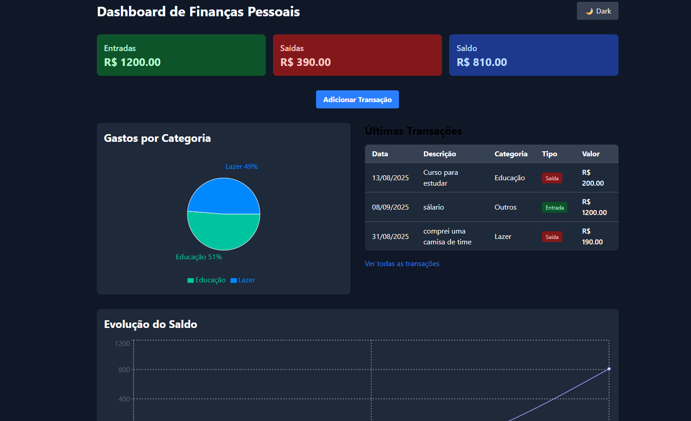
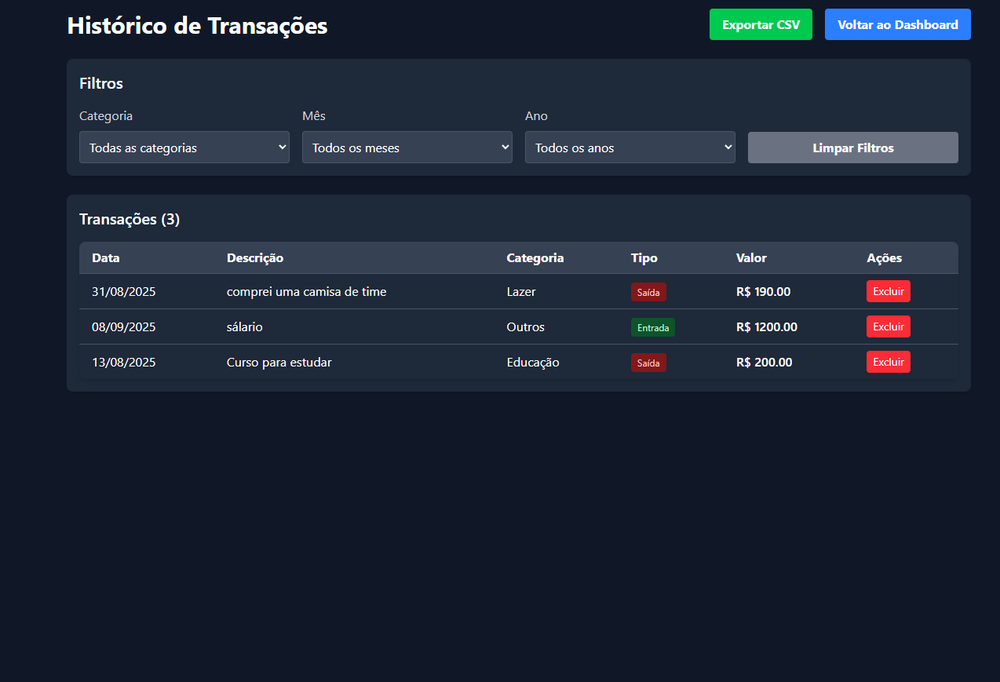

# 💰 Dashboard de Finanças Pessoais

Um sistema web para controle de **finanças pessoais**, que permite:
---

✅ Registrar entradas e saídas

✅ Visualizar saldo total

✅ Analisar gastos por categoria

✅ Acompanhar gráficos de evolução financeira

---

## 🖼️ Demonstração

## Página inicial



---
## Histórico



---

## 🔹 Funcionalidades

* ➕ **Adicionar transações** (Entrada ou Saída) com:

  * Valor
  * Categoria
  * Data
  * Descrição
* 📊 **Gráficos interativos**:

  * Gastos por categoria (Pizza)
  * Evolução do saldo (Linha)
* 📋 **Histórico completo** de transações com filtros (data e categoria)
* 💾 **Persistência de dados** via `localStorage` (funciona offline)
* 🌙 **Dark Mode** (opcional de implementar)

---

## 🛠 Tecnologias Utilizadas

* ⚛️ **React** – Front-end moderno e reativo
* 🎨 **TailwindCSS** – Estilização rápida e responsiva
* 📈 **Recharts** – Visualização de gráficos
* 💾 **LocalStorage** – Armazenamento local

---

## 📂 Estrutura do Projeto

```
finance-dashboard/
├─ public/
├─ src/
│  ├─ components/  
│  ├─ contexts/   
│  ├─ pages/        
│  ├─ utils/        
│  ├─ App.jsx
│  ├─ App.css
│  ├─ index.css
│  └─ main.jsx
├─ package.json
└─ tailwind.config.js
```

---

## 💻 Como Rodar Localmente

1. **Clonar o repositório**

```bash
git clone https://github.com/seu-usuario/finance-dashboard.git
cd finance-dashboard
```

2. **Instalar dependências**

```bash
npm install
# ou
yarn
```

3. **Rodar o servidor de desenvolvimento**

```bash
npm run dev
# ou
yarn dev
```

> O projeto estará disponível em: [http://localhost:5173](http://localhost:5173)

---

## ⚡ Recursos Extras

* 🔌 **Backend Fake com json-server**:

  ```bash
  npm install -g json-server
  json-server --watch db.json --port 3001
  ```
* 🌙 Dark Mode com TailwindCSS
* 📤 Exportar dados em **CSV/PDF**

---

## 🤝 Contribuição

Contribuições são **bem-vindas**! Você pode:

* 🐛 Abrir *issues* para bugs ou sugestões
* 🚀 Criar *pull requests* com novas funcionalidades

📌 Sugestões de melhorias:

* Dashboard mais interativo com **filtros dinâmicos**
* Integração com **APIs externas** de câmbio ou bancos

---
